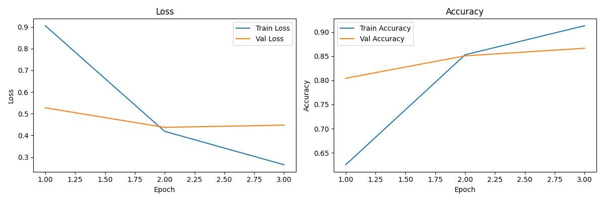
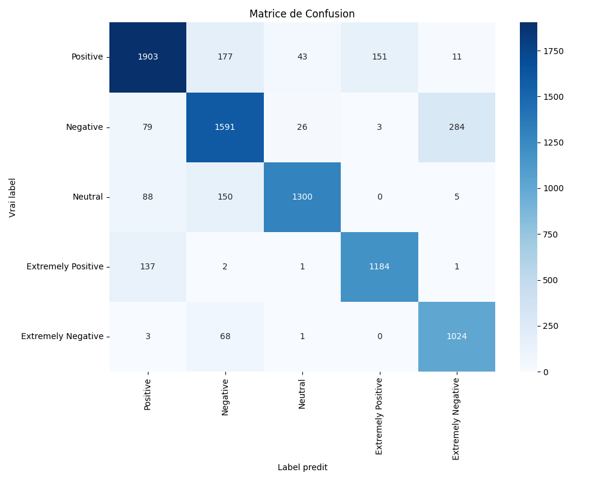
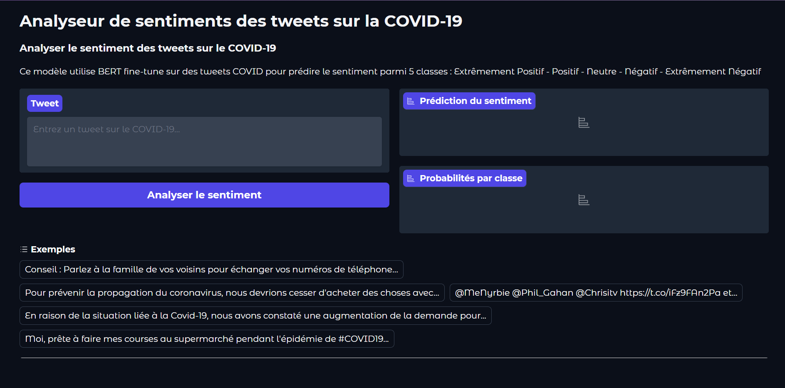
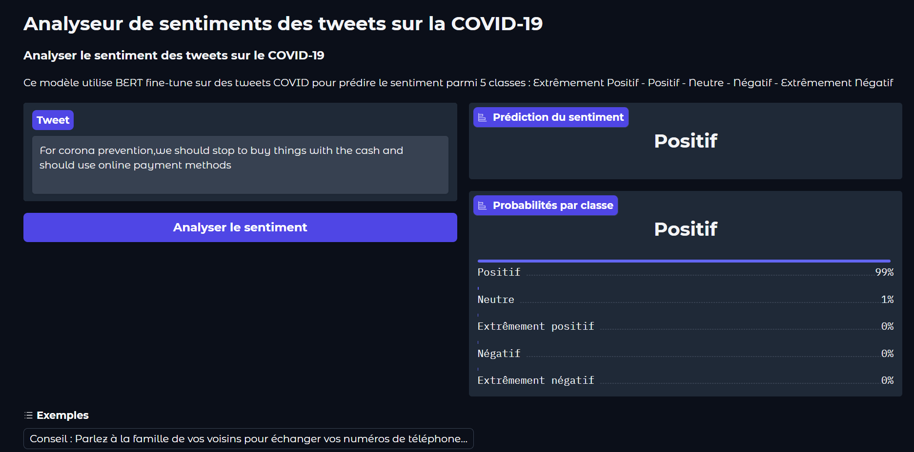

# BERT Sentiment Analysis - COVID-19 Tweets

## Auteurs
- Adji Fatou NGOM
- Viwossin DEGBOE

## Description du projet

Ce projet fine-tune le modele BERT pour classifier le sentiment des tweets sur le COVID-19 parmi 5 classes : Positive, Negative, Neutral, Extremely Positive et Extremely Negative.

## Dataset

Source : Corona NLP Dataset fourni par le professeur.

| Classe            | Nombre de tweets|
|-------------------|-----------------|
| Positive          | 11 422          |
| Negative          | 9 917           |
| Neutral           | 7 713           |
| Extremely Positive| 6 624           |
| Extremely Negative| 5 481           |
| Total             | 41 157          |

Ratio max/min : 2.08 leger desequilibre acceptable.

Longueur des tweets : Min 1 mot - Max 64 mots - Moyenne 31 mots. Max length choisi : 128 tokens car nos tweets font maximum 64 mots donc 128 tokens suffit largement.

5 exemples de tweets avec leurs labels :

| Tweet                                                           | Sentiment |
|-----------------------------------------------------------------|-----------|
| advice Talk to your neighbours family to exchange phone numbers | Positive |
| For corona prevention we should stop to buy things with cash    | Negative |
| @MeNyrbie @Phil_Gahan @Chrisitv https://t.co/iFz9FAn2Pa         | Neutral |
| Due to the Covid-19 situation we have increased demand for all food products | Extremely Positive |
| Me ready to go at supermarket during the COVID19 outbreak        | Extremely Negative |

## Modele et choix techniques

Modele : bert-base-uncased

| Hyperparametre | Valeur               | Justification |
|----------------|----------------------|---------------|
| Learning rate  | 2e-5                 | Valeur minimale recommandee pour le fine-tuning de BERT. Plus stable et evite le catastrophic forgetting |
| Batch size     | 16                   | Limite de VRAM sur Google Colab GPU T4 |
| Epochs         | 3                    | BERT converge rapidement. La val_loss remontait a l epoch 3 signe d overfitting |
| Max length     | 128                  | Nos tweets font maximum 64 mots. 128 tokens suffit largement |
| Optimiseur     | AdamW                | Meilleur que Adam pour BERT avec weight_decay=0.01 |
| Scheduler      | Lineaire avec warmup | Le learning rate monte progressivement pour ne pas perturber les poids pre-entraines |
| Loss           | CrossEntropyLoss     | Classification multiclasse standard |
| Seed           | 42                   | Reproductibilite des resultats |

## Structure du projet

```
bert-sentiment-covid/
├── data/
│   └── download_data.py
├── dataset.py
├── model.py
├── train.py
├── utils.py
├── main.py
├── demo.py
├── requirements.txt
└── README.md
```

## Installation

```bash
git clone https://github.com/Djifa02/bert-sentiment-covid.git
cd bert-sentiment-covid
py -3.11 -m venv venv
venv\Scripts\activate
pip install -r requirements.txt
python data/download_data.py
```

## Lancer l entrainement

```bash
python main.py
```

## Lancer la demo

```bash
python demo.py
```

## Resultats

| Epoch | Train Loss | Train Acc | Val Loss | Val Acc | F1     |
|-------|------------|-----------|----------|---------|--------|
| 1     | 0.9055     | 62.53%    | 0.5270   | 80.42%  | 0.8040 |
| 2     | 0.4185     | 85.28%    | 0.4369   | 85.06%  | 0.8510 |
| 3     | 0.2645     | 91.29%    | 0.4474   | 86.63%  | 0.8663 |

Meilleur modele : Epoch 2
Val Loss : 0.4369
Val Acc  : 85.06%
F1 Score : 0.8510

Rapport de classification :

| Classe             | Precision | Recall | F1   |
|--------------------|-----------|--------|------|
| Positive           | 0.86      | 0.83   | 0.85 |
| Negative           | 0.80      | 0.80   | 0.80 |
| Neutral            | 0.95      | 0.84   | 0.89 |
| Extremely Positive | 0.88      | 0.89   | 0.89 |
| Extremely Negative | 0.77      | 0.93   | 0.85 |
| Accuracy           |           |        | 0.85 |

## Analyse

Les courbes confirment que le modele commence a overfitter a partir de l epoch 3. La val_loss remonte de 0.4369 a 0.4474 et l ecart entre train accuracy 91% et val accuracy 86% se creuse. Le meilleur modele est donc celui de l epoch 2 selon le critere best val_loss demande par le professeur avec Val Acc 85% et F1 0.85.
La classe Neutral obtient la meilleure precision 0.95 car ses tweets sont facilement distinguables. La classe Extremely Negative obtient le meilleur recall 0.93 ce qui signifie que le modele detecte bien les tweets tres negatifs. La principale confusion se trouve entre Negative et Extremely Negative avec 284 tweets mal classes ce qui est normal car ces deux classes sont semantiquement proches.
Nous recommandons ce modele pour la detection de sentiment sur des tweets COVID car il obtient une accuracy globale de 85% avec seulement 3 epochs de fine-tuning.

### Courbes d entrainement



### Matrice de confusion



### Captures d ecran de la demo Gradio





## Repartition du travail

| Tache                                                 | Responsable      |
|-------------------------------------------------------|------------------|
| Gestion du repo GitHub et Scrum Master                | Adji Fatou NGOM  |
| Choix du modele BERT et planification                 | Ensemble         |
| Dataset et architecture du modele                     | Viwossin DEGBOE  |
| Choix des hyperparametres et fonctions d entrainement | Adji Fatou NGOM  |
| Entrainement du modele GPU                            | Viwossin DEGBOE  |
| Captures d ecran de la demo                           | Adji Fatou NGOM  |
| Rapport README                                        | Ensemble         |
